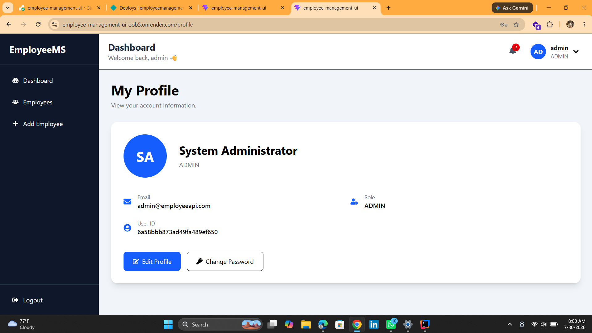
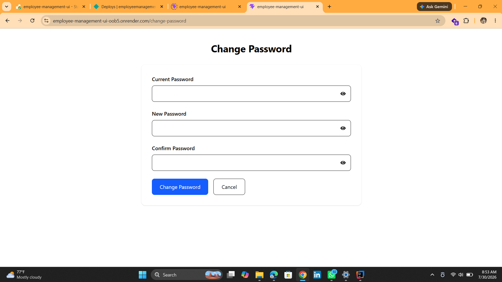

# Employee Management Platform

A modern, responsive Employee Management Platform built with **React**, **Vite**, **Tailwind CSS**, and **Axios**.

The application communicates with a Spring Boot REST API secured with JWT Authentication and provides a clean interface for administrators and employees to manage employee records securely.

---

# 🌐 Live Application

### Live Demo

https://employee-management-ui-oob5.onrender.com/

### Backend API

https://employee-api-6lau.onrender.com/

### Swagger Documentation

https://employee-api-6lau.onrender.com/swagger-ui/index.html

---

# 📌 Overview

The Employee Management Platform provides a secure environment for managing employees.

## Administrator Features

- Secure Login
- Dashboard
- Create Employee
- Edit Employee
- Delete Employee
- Search Employees
- Sort Employees
- Pagination

## Employee Features

- Secure Login
- View Profile
- Edit Profile
- Change Password

---

# 🚀 Features

- JWT Authentication
- Protected Routes
- Responsive Dashboard
- Employee CRUD
- Search
- Sorting
- Pagination
- Toast Notifications
- Loading Skeletons
- Mobile Responsive Design

---

# 🛠 Tech Stack

- React
- Vite
- Tailwind CSS
- React Router
- Axios
- React Hot Toast
- Material UI Icons

---

# 📂 Project Structure

```text
src
├── components
├── layouts
├── pages
├── routes
├── services
├── assets
└── App.jsx
```

---

# 🔐 Authentication

Authentication is handled using JWT tokens.

The application automatically:

- Stores JWT after login
- Sends Bearer Token on protected requests
- Redirects users to Login when a token expires

---

# 📸 Screenshots

## Login


---

## Dashboard


---

## Employee List


---

## Create Employee


---

## Edit Employee


---

## Profile



---

## Change Password



---

# 🚀 Running Locally

Clone the repository

```bash
git clone https://github.com/Longlasting1805/employee-management-ui.git
```

Install dependencies

```bash
npm install
```

Create a `.env` file

```env
VITE_API_BASE_URL=http://localhost:8080/api
```

Run the project

```bash
npm run dev
```

---

# 🌍 Deployment

Frontend

https://employee-management-ui-oob5.onrender.com/

Backend

https://employee-api-6lau.onrender.com/

---

# 🔮 Future Improvements

- Dark Mode
- Dashboard Analytics
- Employee Avatar Upload
- Department Management
- Export to Excel/PDF
- Notification Center
- Activity Logs

---

# 🔗 Backend Repository

https://github.com/YOUR_USERNAME/employee-api

---

# 👨‍💻 Author

**Akande Kehinde**

Software Engineer

React • Java • Spring Boot • MongoDB • Docker • JWT • REST APIs